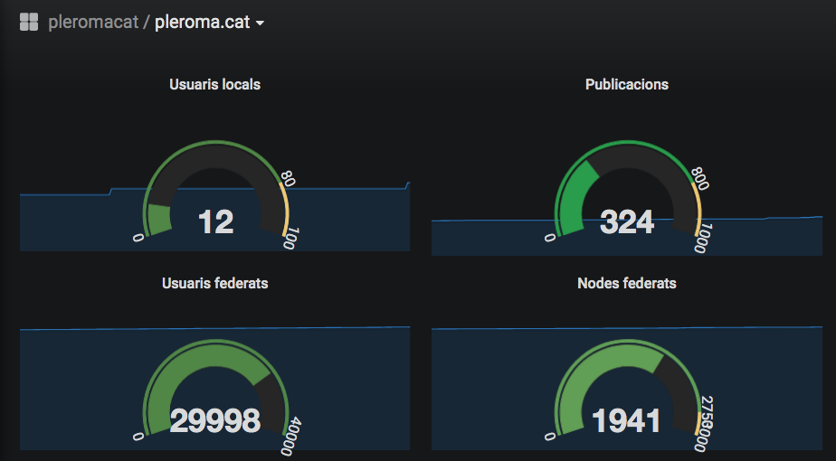

Graphical Pleroma's stats with Python + Postgresql + Grafana
============================================================

Python script that gets *realtime* stats data from [Pleroma](https://pleroma.social)'s DB.

### Dependencies

-   **Python 2**
-   Grafana
-   Postgresql server 
-   Everything else at the top of `pleroma-stats.py`!

### Usage:

1. Edit `config.txt` to specify the hostname of the Pleroma server you would like to get data from, its DB 
   name and DB user and also the DB name and DB user for Grafana.

2. Create one Postgresql database for Grafana, in example 'pleroma_stats', with two tables:

CREATE TABLE stats(
DATETIME TIMESTAMPTZ PRIMARY KEY NOT NULL,
USERS INT,
USERS_HOUR INT,
POSTS INT,
POSTS_HOUR INT, POSTS_USERS INT,
INTERACTIONS INT,
ACTIVE INT, ACTIVE30 INT,
SERVERS INT, SERVERS_HOUR INT,
POSTS_ACTIVE INT,
FEDERATED_USERS INT, FEDERATED_USERS_HOUR INT
);

CREATE TABLE unreached_servers(
SERVER VARCHAR(30),
SINCE TIMESTAMP,
DAYS VARCHAR(30),
INSERTED_AT TIMESTAMP PRIMARY KEY NOT NULL,
DATETIME TIMESTAMPTZ
);

3. Run 'python pleroma-stats-py' within Python Virtual Environment to test everything is OK. Install all needed packages with 'pip install package'
4. Use your favourite scheduling method to set `./pleroma-stats.py` to run regularly.
5. Add the datasource PostgreSQL to your Grafana, configuring Host (usually localhost:5432), Database (in the example is pleroma_stats) and User fields. 

Then you could graph your Pleroma server stats with Grafana's PostgreSQL datasource!
It gets all needed data from Pleroma's Postgresql database and then store stats to a new Postgresql database created above, to feed Grafana with their values.

